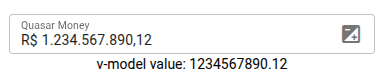

# quasar-money

## Project

If you're looking for a Quasar component to format money values, this might be helpful.  
It supports both positive and negative numbers. 



## Links

[GitHub](https://github.com/juareznasato/quasar-money).  
[npm](https://www.npmjs.com/package/quasar-money).  

## Dependencies
```
- vue-3
- quasar-2
- moment ($ npm install moment --save)
```

## Install

```
$ npm install quasar-money --save
```

## How to use

```vue
<template>
  <div>
    <quasar-money
      ref="refQuasarMoney"
      v-model="value"
      v-bind:label="'Quasar Money'"
      v-bind:prefix="'R$'"
      v-bind:suffix="''"
      v-bind:disable="false"
      v-bind:negativeNumber="true"
      v-bind:properties="quasarMoneyConfig.properties"
      v-bind:options="quasarMoneyConfig.options"
    ></quasar-money>
  </div>
</template>
<script setup>
import { ref } from "vue";
import quasarMoney from 'quasar-money'

const refQuasarMoney = ref("");
let value = ref(1234567890.12);

let quasarMoneyConfig = {
  properties: {
    dense: true,
    outlined: true,
    stackLabel: true,
    // ...
    // You can pass any valid "q-input" prop here
  },
  options: {
    locale: "pt-BR",
    length: 11,
    precision: 2,
    empty: null,
  },
};
function focus() {
  refQuasarMoney.value.focus();
}
function select() {
  refQuasarMoney.value.select();
}
</script>
```

## Properties (v-bind:properties)

You can pass any valid q-input prop to this component.
For a full list of available props, refer to the [q-input API](https://quasar.dev/vue-components/input#qinput-api).

Props that contain hyphens (e.g., single-line, background-color) can be used in the following ways:

```vue
quasarMoney.properties="{ singleLine: true, backgroundColor: 'red' }"

or

quasarMoney.properties="{ 'single-line': true, 'background-color': 'red' }"
```

## Events

| Event     | value         | Description                                           |
| --------- | ------------- | ----------------------------------------------------- |
| blur      | Event         | Emitted when the input is blurred                     |
| change    | any           | Emitted when the input is changed by user interaction |
| click     | MouseEvent    | Emitted when input is clicked                         |
| focus     | Event         | Emitted when component is focused                     |
| keydown   | KeyboardEvent | Emitted when any key is pressed                       |
| mousedown | MouseEvent    | Emitted when click is pressed                         |
| mouseup   | MouseEvent    | Event mouseup                                         |

## Support me
If you enjoy or benefit from my work, your support helps me keep going and creating even more.  
Please consider starring the repository and buying me a coffee. Every coffee means a lot — thank you for your support!  
[](https://ko-fi.com/juareznasato)
